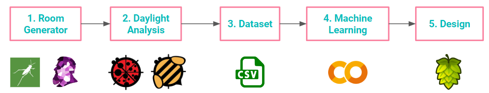

# project brief
DayLite

## description
DayLite responds to the issues with daylight analysis tools, which require an investment in time and training. DayLite is a tool related to Machine Learning supervised predictions for quick and easy daylighting design. The designs can be evaluated and the selected design can be generated in 3D modeling software and a web application.

Using parametric sliders, the user can control various properties of the a site, such as:

- Floor Height

- Room Dimensions

- Room Orientation

- Window Height
 

- Window Sill Height
  

- Shading Depth

- Glazing Ratio

- Context Height

- Context Offset 

The Daylighting predicted outputs are the following
 

1. Spatial Daylight Autonomy (sDA)

2. Useful Daylight Illuminance (UDI)

3. Annual Sunlight Exposure (ASE)

## plugins
Ladybug & Honeybee

## workflow diagram

## author

Amanda Gioia

Background: Architecture + Design Technology

Faculty: Angelos Chronis 

Course: Thesis

Program: MaCAD from Institute for Advanced Architecture of Catalonia

## credits
Very special thanks to Angelos Chronis, David Andres Leon, Hesham Shawqy, Aris Vartholomaios, and Sophie Moore!